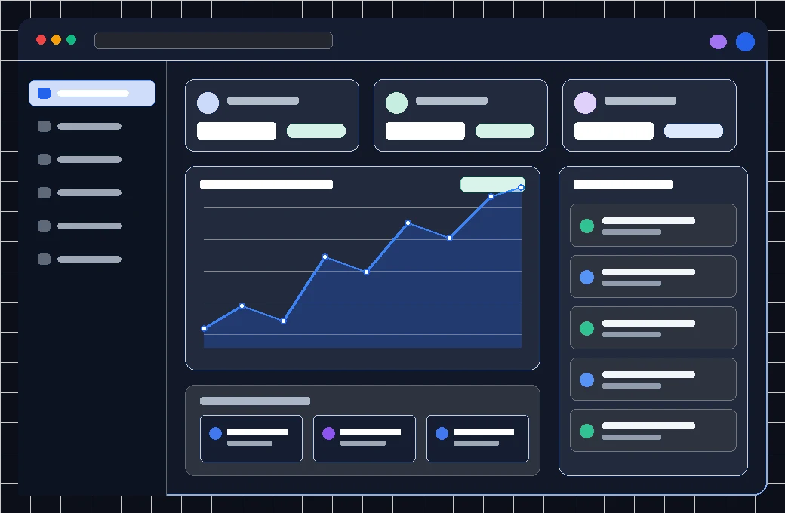

# Stackly — Modern Startup SaaS Platform

A modern, production-grade, all-in-one SaaS workspace frontend platform built with pure vanilla HTML5, modern CSS3, and ES6+ JavaScript.



## 🚀 Features

- **Marketing Website**:
  - Landing Page (`index.html`) with 3D interactive hero showcase, staggered entrance animations, and ambient aurora glows.
  - Full pages for About (`about.html`), Product (`product.html`), Features (`features.html`), Solutions (`solutions.html`), Pricing (`pricing.html`), Integrations (`integrations.html`), Resources (`resources.html`), and Contact (`contact.html`).
- **Authentication**:
  - Clean Login (`login.html`) and Registration (`register.html`) pages with dynamic role switching (User / Super Admin) and client-side session management (`localStorage`).
- **User Workspace Dashboards**:
  - User Overview (`user-dashboard.html`)
  - Profile Management (`user-profile.html`)
  - Projects (`user-projects.html`), Tasks Kanban (`user-tasks.html`), Team Directory (`user-team.html`)
  - Analytics (`user-analytics.html`), Reports (`user-reports.html`), Files Vault (`user-files.html`), Notifications (`user-notifications.html`), Settings (`user-settings.html`)
- **Executive Admin Governance Suite**:
  - System Overview (`admin-dashboard.html`)
  - User Directory (`admin-users.html`), Team Management (`admin-teams.html`)
  - Subscriptions (`admin-subscriptions.html`), Billing & Invoicing (`admin-billing.html`)
  - System Analytics (`admin-analytics.html`), Immutable Audit Logs (`admin-audit.html`)
- **Key UX Features**:
  - Fixed non-scrolling desktop left sidebar with independent internal scroll.
  - Mobile off-canvas drawer with smooth backdrop blur.
  - Command palette search modal (`Ctrl+K` / `⌘K`).
  - Interactive Canvas charts (no heavy external chart libraries required).
  - High-performance scroll reveal animations powered by IntersectionObserver.

## 💻 Tech Stack

- **HTML5**: Semantic, accessible structure.
- **CSS3**: Modern CSS custom properties (variables), CSS Grid, Flexbox, Keyframe animations, and Glassmorphism effects.
- **JavaScript (ES6+)**: Zero external dependencies, pure vanilla DOM engine.

## 🛠️ Getting Started

1. Clone or download the repository:
   ```bash
   git clone https://github.com/Sureshkappala/Startup-Saas.git
   ```
2. Open `index.html` in any modern web browser or run with a local web server (e.g. Live Server, `npx serve`, or `python -m http.server`).

---
Built with ❤️ for modern high-growth teams.
